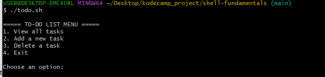
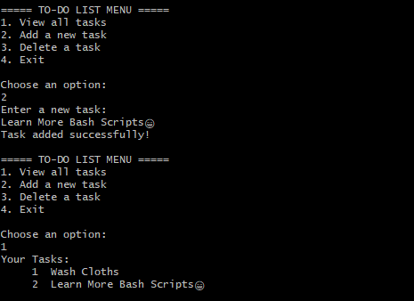
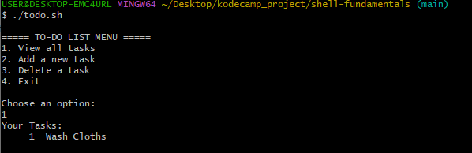
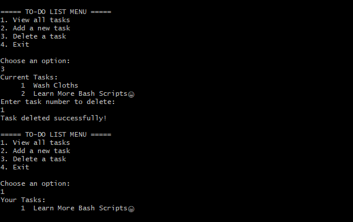

# Shell Fundamentals - Bash To-Do List Manager

This project is a simple interactive To-Do List manager built using Bash scripting.

The application runs in the terminal and allows users to:

- View all tasks
- Add new tasks
- Delete tasks
- Exit the application

Tasks are stored persistently in a `todo.txt` file located in the user's home directory.

---

# Features

- Interactive terminal menu
- Persistent task storage
- Numbered task listing
- Delete tasks by line number
- Continuous loop until user exits

---

# Technologies Used

- Bash Scripting
- Linux Shell Commands

---

# Project Structure

```text
shell-fundamentals/
│
├── todo.sh
├── README.md
└── screenshots/
```

---

# How to Run the Script

## 1. Clone the repository

```bash
git clone https://github.com/MichaelTolulope/shell-fundamentals.git
```

---

## 2. Navigate into the project folder

```bash
cd shell-fundamentals
```

---

## 3. Make the script executable

```bash
chmod +x todo.sh
```

---

## 4. Run the script

```bash
./todo.sh
```

---

# Script Functionalities

## View Tasks

Displays all saved tasks with numbered lines.

---

## Add Task

Allows the user to enter and save a new task.

---

## Delete Task

Deletes a selected task using its line number.

---

# Screenshots

## Main Menu

_Add screenshot here_

```md

```

Description:
This screenshot shows the main interactive menu displayed when the script starts.

---

## Adding a Task

_Add screenshot here_

```md

```

Description:
This screenshot demonstrates adding a new task to the to-do list.

---

## Viewing Tasks

_Add screenshot here_

```md

```

Description:
This screenshot shows all saved tasks displayed with numbered lines.

---

## Deleting a Task

_Add screenshot here_

```md

```

Description:
This screenshot demonstrates deleting a task using its task number.

---

# Commands Used

| Command | Purpose |
|---|---|
| `read` | Accept user input |
| `echo` | Display and append text |
| `nl` | Display numbered lines |
| `sed -i` | Delete a task by line number |
| `while` | Keep the menu running |
| `case` | Handle menu options |

---

# Author

Michael Olagunju
